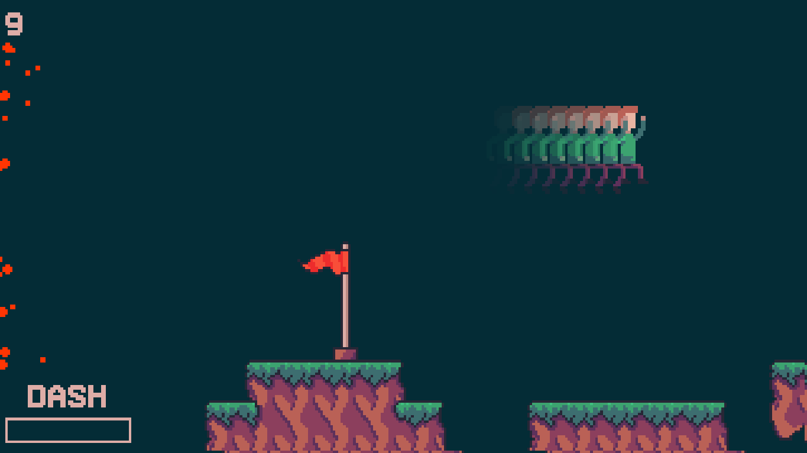

# 🏃‍♂️💨 DashRun

DashRun is an endless arcade platformer game where you play as a runner and aim to survive the longest.

It was made for a school project by Lilian Scicluna and Matteo Planchet aka PainOchoco.

It is written in Python with the library Pygame. It was a school project but i'm planning on improving it (maybe a multiplayer feature?).

## 🎮 How to play

The game is only available on Windows for the moment.

1. Download the DashRun.zip in the latest release
2. Extract it
3. Execute main.exe
4. Check controls right below

## 🕹 Controls

I didn't have time to implement a menu system, so here are the controls (it was made for french keyboards).

if you are looking a bit you can change the controls in the `settings.py` file using the [Pygame keys](https://www.pygame.org/docs/ref/key.html)

-   ⬆ Z or Up arrow
-   ⬇ S or Down arrow
-   ➡ D or Right arrow
-   ⬅ Q or Left arrow
-   Dash Shift or Tab
-   Fullscreen F or F11
-   Debug F3

## ⚡ Scoreboard

I'll put top scores here! Send me a screenshot of your best score on Discord @PainOchoco#3570!

On your marks, ready? Go !

1. PainOchoco - `1100`

## 🛠 Tools Used

-   [Pygame](https://pygame.org) - Game Library
-   [GIMP](https://www.gimp.org) - Image editing
-   [Tiled](https://www.mapeditor.org/) - Level editing
-   [PyInstaller](https://www.pyinstaller.org/) - Stand-alone executables builder

## 🎨 Assets Used

-   Tileset [Morning Adventures](https://spriteshift.itch.io/morning-adventures-tileset) by Spriteshift
-   Music [Can't Stop Won't Stop](https://www.youtube.com/watch?v=gELKqteThq8) by AdhesiveWombat
-   Font [Vermin Vibes 1989](https://www.dafont.com/fr/vermin-vibes-1989.font) by NAL
-   Font [Superstar](https://www.dafont.com/fr/superstar-2.font)
-   Soundpack [The Essential Retro Video Game Sound Effects Collection](https://opengameart.org/content/512-sound-effects-8-bit-style) by SubspaceAudio
